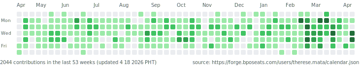

# Hi, I'm Ders! 👾
### Full-Stack Developer | Technical Lead | Product Builder

)

## GitLab Contributions
<picture>
  <source media="(prefers-color-scheme: dark)" srcset="./assets/gitlab-contributions-dark.svg" />
  
</picture>

`npm run generate:gitlab-calendar` refreshes the SVG locally.

## About Me
I build maintainable web applications with a strong focus on performance, delivery quality, and user impact.

- 3+ years as a professional developer
- 30+ delivered features in production
- Current role: **Associate Technical Lead**
- Core product experience: **HQZen**, **ScaleMA**, **BPOSeats**
- Direct development ownership: **[HQZen.com](https://hqzen.com)**

## Experience Snapshot
**Channel Information Technology Inc.**  
*Key projects:* [HQZen.com](https://hqzen.com) · [Bposeats.com](https://bposeats.com) · [Scalema.com](https://scalema.com)  
💼   **_Associate Technical Lead_** · Jan 2026 – Present  
💼   **_Full-Stack Developer_** · Sep 2023 – Present  
💼   **_Technical Field Consultant_** · Jul 2024 – Jan 2026  

## Tech Stack
**Frontend**

**Backend & Data**

**Tools**

## Featured Projects
### TapTrack (2025)
Mobile-first PWA for real-time expense management with spreadsheet export for easier auditing.

### KaLunWA (2022)
Environmental organization platform with CMS features for administrators.
- Repo: [ManaTech-Group-4/KaLunWA](https://github.com/ManaTech-Group-4/KaLunWA)

### HQZen Product Modules
Delivered production modules across ticketing, channels, Kanban, notifications, and progress tracking.

## Let's Connect
- Email: [therese.bposeats@gmail.com](mailto:therese.bposeats@gmail.com)
- LinkedIn: [therese-raye-mata](https://linkedin.com/in/therese-raye-mata/)
- GitHub: [temata](https://github.com/temata)
- GitLab: [therese.mata](https://forge.bposeats.com/therese.mata)
